# VozTrip — UML Diagrams (PlantUML)

> Bao gồm: Use Case, và Sequence Diagrams cho toàn bộ luồng Du khách · Seller · Admin

---

## 1. Use Case Diagram

```plantuml
@startuml UC_VozTrip
left to right direction
skinparam packageStyle rectangle
skinparam actorStyle awesome

actor "Du khách\n(Tourist)" as G
actor "Seller" as S
actor "Admin" as A
actor "SePay\n(Payment)" as P

rectangle "VozTrip System" {

  package "Du khách" {
    usecase "Chọn ngôn ngữ" as UC_G1
    usecase "Đăng ký thiết bị" as UC_G2
    usecase "Thanh toán truy cập\n(device approval)" as UC_G3
    usecase "Xem danh sách POI" as UC_G4
    usecase "Xem chi tiết POI" as UC_G5
    usecase "Nghe thuyết minh audio" as UC_G6
    usecase "Xem media (ảnh/video)" as UC_G7
    usecase "Hỏi & Đáp tại POI" as UC_G8
    usecase "GPS auto-trigger" as UC_G9
    usecase "Nghe audio khi vào vùng" as UC_G10
    usecase "Xem POI gần đây (Nearby)" as UC_G11
    usecase "Bản đồ tương tác" as UC_G12
    usecase "Quét mã QR → POI" as UC_G13
    usecase "Gọi SOS / Khẩn cấp" as UC_G14
    usecase "Gửi phản hồi / báo lỗi" as UC_G15
    usecase "Xem chính sách bảo mật" as UC_G16
  }

  package "Seller" {
    usecase "Đăng ký tài khoản" as UC_S1
    usecase "Đăng nhập" as UC_S2
    usecase "Xem profile shop" as UC_S3
    usecase "Xem dashboard thống kê" as UC_S4
    usecase "Tạo / Sửa / Xóa POI" as UC_S5
    usecase "Quản lý localization POI" as UC_S6
    usecase "Upload audio thuyết minh" as UC_S7
    usecase "Tự động dịch nội dung" as UC_S8
    usecase "Quản lý media (ảnh/video)" as UC_S9
    usecase "Quản lý Q&A" as UC_S10
    usecase "Nâng cấp VIP (SePay QR)" as UC_S11
    usecase "Boost POI (SePay QR)" as UC_S12
    usecase "Tạo QR code → POI" as UC_S13
  }

  package "Admin" {
    usecase "Đăng nhập admin" as UC_A1
    usecase "Xem dashboard hệ thống" as UC_A2
    usecase "Duyệt / Tạo seller" as UC_A3
    usecase "Quản lý users" as UC_A4
    usecase "Kiểm duyệt POI" as UC_A5
    usecase "Kiểm duyệt media" as UC_A6
    usecase "Theo dõi thiết bị" as UC_A7
    usecase "Duyệt thiết bị thủ công" as UC_A8
    usecase "Quản lý zones" as UC_A9
    usecase "Quản lý ngôn ngữ" as UC_A10
    usecase "Bật/tắt feature flags" as UC_A11
    usecase "Xem phản hồi người dùng" as UC_A12
    usecase "Xem bản đồ POI admin" as UC_A13
  }
}

G --> UC_G1
G --> UC_G2
G --> UC_G3
G --> UC_G4
G --> UC_G5
G --> UC_G6
G --> UC_G7
G --> UC_G8
UC_G9 .> UC_G10 : <<include>>
G --> UC_G9
G --> UC_G11
G --> UC_G12
G --> UC_G13
G --> UC_G14
G --> UC_G15
G --> UC_G16

S --> UC_S1
S --> UC_S2
S --> UC_S3
S --> UC_S4
S --> UC_S5
S --> UC_S6
S --> UC_S7
S --> UC_S8
S --> UC_S9
S --> UC_S10
S --> UC_S11
S --> UC_S12
S --> UC_S13

A --> UC_A1
A --> UC_A2
A --> UC_A3
A --> UC_A4
A --> UC_A5
A --> UC_A6
A --> UC_A7
UC_A7 .> UC_A8 : <<extend>>
A --> UC_A9
A --> UC_A10
A --> UC_A11
A --> UC_A12
A --> UC_A13

P --> UC_G3 : webhook
P --> UC_S11 : webhook
P --> UC_S12 : webhook
@enduml
```

---

## 2. Sequence: Đăng ký & Đăng nhập (Auth)

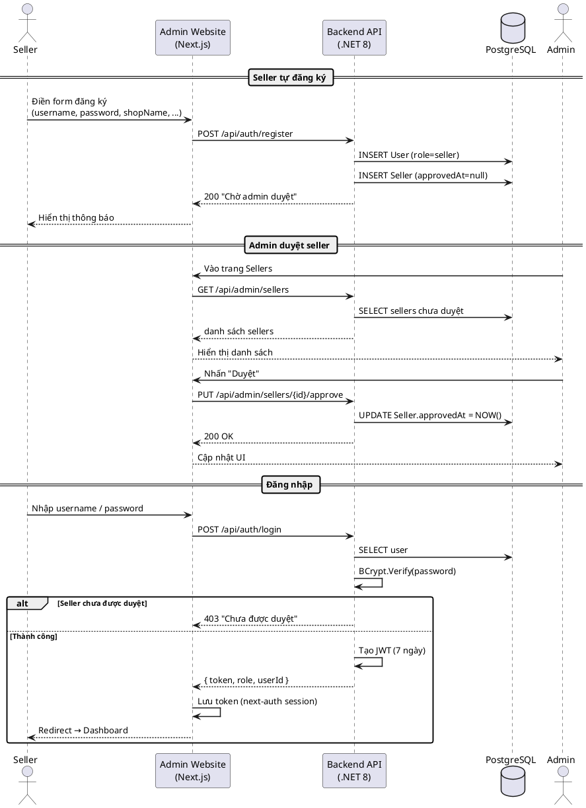
```plantuml
@startuml SEQ_Auth
skinparam sequenceArrowThickness 1.5
skinparam roundcorner 6

actor "Seller" as S
participant "Admin Website\n(Next.js)" as AW
participant "Backend API\n(.NET 8)" as BE
database "PostgreSQL" as DB

== Seller tự đăng ký ==
S -> AW: Điền form đăng ký\n(username, password, shopName, ...)
AW -> BE: POST /api/auth/register
BE -> DB: INSERT User (role=seller)
BE -> DB: INSERT Seller (approvedAt=null)
BE --> AW: 200 "Chờ admin duyệt"
AW --> S: Hiển thị thông báo

== Admin duyệt seller ==
actor "Admin" as A
A -> AW: Vào trang Sellers
AW -> BE: GET /api/admin/sellers
BE -> DB: SELECT sellers chưa duyệt
BE --> AW: danh sách sellers
AW --> A: Hiển thị danh sách
A -> AW: Nhấn "Duyệt"
AW -> BE: PUT /api/admin/sellers/{id}/approve
BE -> DB: UPDATE Seller.approvedAt = NOW()
BE --> AW: 200 OK
AW --> A: Cập nhật UI

== Đăng nhập ==
S -> AW: Nhập username / password
AW -> BE: POST /api/auth/login
BE -> DB: SELECT user
BE -> BE: BCrypt.Verify(password)
alt Seller chưa được duyệt
  BE --> AW: 403 "Chưa được duyệt"
else Thành công
  BE -> BE: Tạo JWT (7 ngày)
  BE --> AW: { token, role, userId }
  AW -> AW: Lưu token (next-auth session)
  AW --> S: Redirect → Dashboard
end
@enduml
```

---

## 3. Sequence: Du khách — Khởi động & Chọn ngôn ngữ

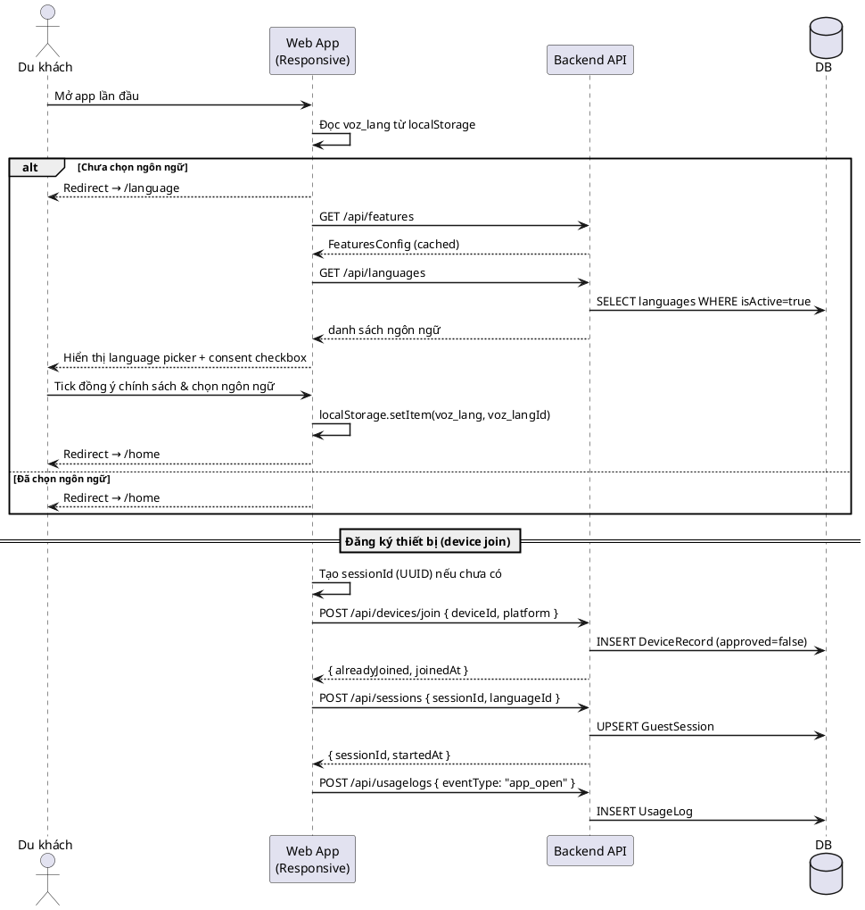
```plantuml
@startuml SEQ_Tourist_Init
skinparam sequenceArrowThickness 1.5

actor "Du khách" as G
participant "Web App\n(Responsive)" as WA
participant "Backend API" as BE
database "DB" as DB

G -> WA: Mở app lần đầu
WA -> WA: Đọc voz_lang từ localStorage
alt Chưa chọn ngôn ngữ
  WA --> G: Redirect → /language
  WA -> BE: GET /api/features
  BE --> WA: FeaturesConfig (cached)
  WA -> BE: GET /api/languages
  BE -> DB: SELECT languages WHERE isActive=true
  BE --> WA: danh sách ngôn ngữ
  WA --> G: Hiển thị language picker + consent checkbox
  G -> WA: Tick đồng ý chính sách & chọn ngôn ngữ
  WA -> WA: localStorage.setItem(voz_lang, voz_langId)
  WA --> G: Redirect → /home
else Đã chọn ngôn ngữ
  WA --> G: Redirect → /home
end

== Đăng ký thiết bị (device join) ==
WA -> WA: Tạo sessionId (UUID) nếu chưa có
WA -> BE: POST /api/devices/join { deviceId, platform }
BE -> DB: INSERT DeviceRecord (approved=false)
BE --> WA: { alreadyJoined, joinedAt }
WA -> BE: POST /api/sessions { sessionId, languageId }
BE -> DB: UPSERT GuestSession
BE --> WA: { sessionId, startedAt }
WA -> BE: POST /api/usagelogs { eventType: "app_open" }
BE -> DB: INSERT UsageLog
@enduml
```

---

## 4. Sequence: Du khách — Thanh toán truy cập (Device Approval)

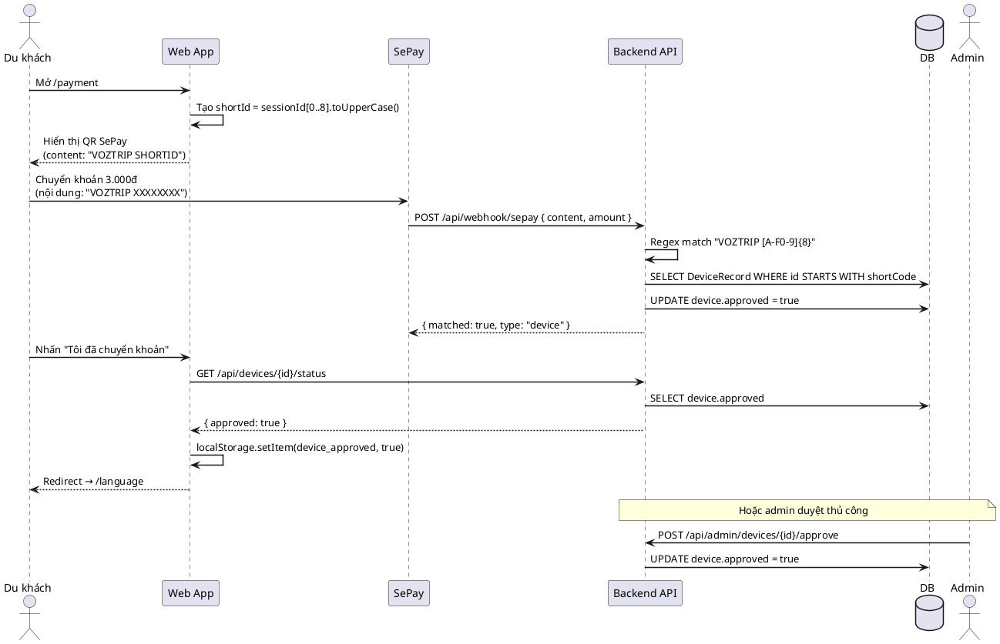
```plantuml
@startuml SEQ_Tourist_Payment
skinparam sequenceArrowThickness 1.5

actor "Du khách" as G
participant "Web App" as WA
participant "SePay" as SP
participant "Backend API" as BE
database "DB" as DB
actor "Admin" as A

G -> WA: Mở /payment
WA -> WA: Tạo shortId = sessionId[0..8].toUpperCase()
WA --> G: Hiển thị QR SePay\n(content: "VOZTRIP SHORTID")

G -> SP: Chuyển khoản 3.000đ\n(nội dung: "VOZTRIP XXXXXXXX")
SP -> BE: POST /api/webhook/sepay { content, amount }
BE -> BE: Regex match "VOZTRIP [A-F0-9]{8}"
BE -> DB: SELECT DeviceRecord WHERE id STARTS WITH shortCode
BE -> DB: UPDATE device.approved = true
BE --> SP: { matched: true, type: "device" }

G -> WA: Nhấn "Tôi đã chuyển khoản"
WA -> BE: GET /api/devices/{id}/status
BE -> DB: SELECT device.approved
BE --> WA: { approved: true }
WA -> WA: localStorage.setItem(device_approved, true)
WA --> G: Redirect → /language

note over A,BE: Hoặc admin duyệt thủ công
A -> BE: POST /api/admin/devices/{id}/approve
BE -> DB: UPDATE device.approved = true
@enduml
```

---

## 5. Sequence: Du khách — Xem danh sách & Chi tiết POI

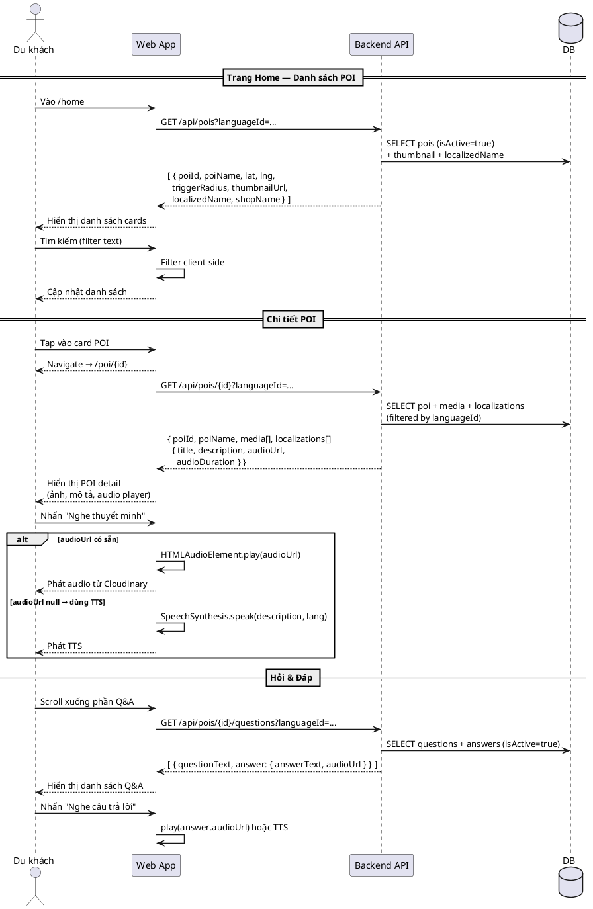
```plantuml
@startuml SEQ_Tourist_POI
skinparam sequenceArrowThickness 1.5

actor "Du khách" as G
participant "Web App" as WA
participant "Backend API" as BE
database "DB" as DB

== Trang Home — Danh sách POI ==
G -> WA: Vào /home
WA -> BE: GET /api/pois?languageId=...
BE -> DB: SELECT pois (isActive=true)\n+ thumbnail + localizedName
BE --> WA: [ { poiId, poiName, lat, lng,\n  triggerRadius, thumbnailUrl,\n  localizedName, shopName } ]
WA --> G: Hiển thị danh sách cards

G -> WA: Tìm kiếm (filter text)
WA -> WA: Filter client-side
WA --> G: Cập nhật danh sách

== Chi tiết POI ==
G -> WA: Tap vào card POI
WA --> G: Navigate → /poi/{id}
WA -> BE: GET /api/pois/{id}?languageId=...
BE -> DB: SELECT poi + media + localizations\n(filtered by languageId)
BE --> WA: { poiId, poiName, media[], localizations[]\n  { title, description, audioUrl,\n    audioDuration } }
WA --> G: Hiển thị POI detail\n(ảnh, mô tả, audio player)

G -> WA: Nhấn "Nghe thuyết minh"
alt audioUrl có sẵn
  WA -> WA: HTMLAudioElement.play(audioUrl)
  WA --> G: Phát audio từ Cloudinary
else audioUrl null → dùng TTS
  WA -> WA: SpeechSynthesis.speak(description, lang)
  WA --> G: Phát TTS
end

== Hỏi & Đáp ==
G -> WA: Scroll xuống phần Q&A
WA -> BE: GET /api/pois/{id}/questions?languageId=...
BE -> DB: SELECT questions + answers (isActive=true)
BE --> WA: [ { questionText, answer: { answerText, audioUrl } } ]
WA --> G: Hiển thị danh sách Q&A
G -> WA: Nhấn "Nghe câu trả lời"
WA -> WA: play(answer.audioUrl) hoặc TTS
@enduml
```

---

## 6. Sequence: Du khách — GPS Auto-Trigger

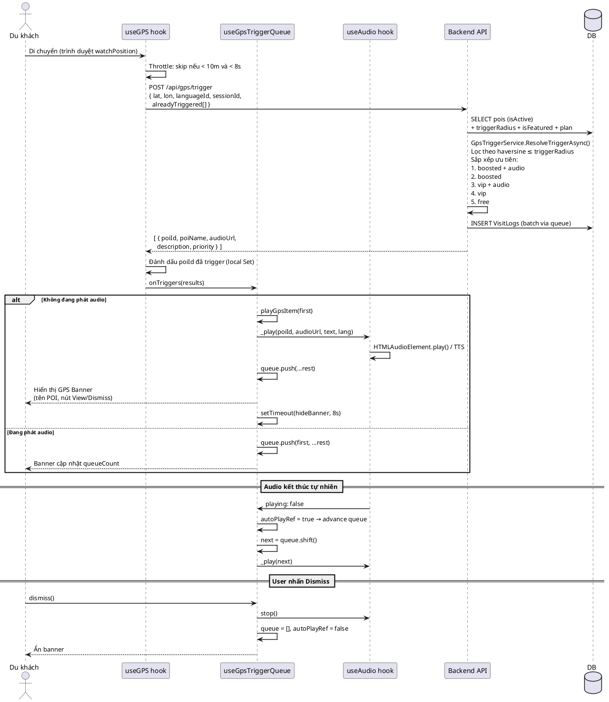
```plantuml
@startuml SEQ_GPS_Trigger
skinparam sequenceArrowThickness 1.5

actor "Du khách" as G
participant "useGPS hook" as GPS
participant "useGpsTriggerQueue" as Q
participant "useAudio hook" as AU
participant "Backend API" as BE
database "DB" as DB

G -> GPS: Di chuyển (trình duyệt watchPosition)
GPS -> GPS: Throttle: skip nếu < 10m và < 8s

GPS -> BE: POST /api/gps/trigger\n{ lat, lon, languageId, sessionId,\n  alreadyTriggered[] }
BE -> DB: SELECT pois (isActive)\n+ triggerRadius + isFeatured + plan
BE -> BE: GpsTriggerService.ResolveTriggerAsync()\nLọc theo haversine ≤ triggerRadius\nSắp xếp ưu tiên:\n1. boosted + audio\n2. boosted\n3. vip + audio\n4. vip\n5. free
BE -> DB: INSERT VisitLogs (batch via queue)
BE --> GPS: [ { poiId, poiName, audioUrl,\n  description, priority } ]

GPS -> GPS: Đánh dấu poiId đã trigger (local Set)
GPS -> Q: onTriggers(results)

alt Không đang phát audio
  Q -> Q: playGpsItem(first)
  Q -> AU: _play(poiId, audioUrl, text, lang)
  AU -> AU: HTMLAudioElement.play() / TTS
  Q -> Q: queue.push(...rest)
  Q --> G: Hiển thị GPS Banner\n(tên POI, nút View/Dismiss)
  Q -> Q: setTimeout(hideBanner, 8s)
else Đang phát audio
  Q -> Q: queue.push(first, ...rest)
  Q --> G: Banner cập nhật queueCount
end

== Audio kết thúc tự nhiên ==
AU -> Q: playing: false
Q -> Q: autoPlayRef = true → advance queue
Q -> Q: next = queue.shift()
Q -> AU: _play(next)

== User nhấn Dismiss ==
G -> Q: dismiss()
Q -> AU: stop()
Q -> Q: queue = [], autoPlayRef = false
Q --> G: Ẩn banner
@enduml
```

---

## 7. Sequence: Du khách — Nearby & Bản đồ

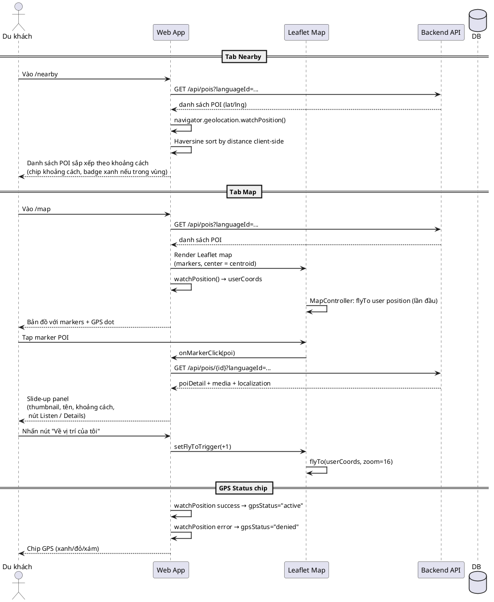
```plantuml
@startuml SEQ_Tourist_Map
skinparam sequenceArrowThickness 1.5

actor "Du khách" as G
participant "Web App" as WA
participant "Leaflet Map" as MAP
participant "Backend API" as BE
database "DB" as DB

== Tab Nearby ==
G -> WA: Vào /nearby
WA -> BE: GET /api/pois?languageId=...
BE --> WA: danh sách POI (lat/lng)
WA -> WA: navigator.geolocation.watchPosition()
WA -> WA: Haversine sort by distance client-side
WA --> G: Danh sách POI sắp xếp theo khoảng cách\n(chip khoảng cách, badge xanh nếu trong vùng)

== Tab Map ==
G -> WA: Vào /map
WA -> BE: GET /api/pois?languageId=...
BE --> WA: danh sách POI
WA -> MAP: Render Leaflet map\n(markers, center = centroid)
WA -> WA: watchPosition() → userCoords
MAP -> MAP: MapController: flyTo user position (lần đầu)
WA --> G: Bản đồ với markers + GPS dot

G -> MAP: Tap marker POI
MAP -> WA: onMarkerClick(poi)
WA -> BE: GET /api/pois/{id}?languageId=...
BE --> WA: poiDetail + media + localization
WA --> G: Slide-up panel\n(thumbnail, tên, khoảng cách,\n nút Listen / Details)

G -> WA: Nhấn nút "Về vị trí của tôi"
WA -> MAP: setFlyToTrigger(+1)
MAP -> MAP: flyTo(userCoords, zoom=16)

== GPS Status chip ==
WA -> WA: watchPosition success → gpsStatus="active"
WA -> WA: watchPosition error → gpsStatus="denied"
WA --> G: Chip GPS (xanh/đỏ/xám)
@enduml
```

---

## 8. Sequence: Du khách — Quét QR

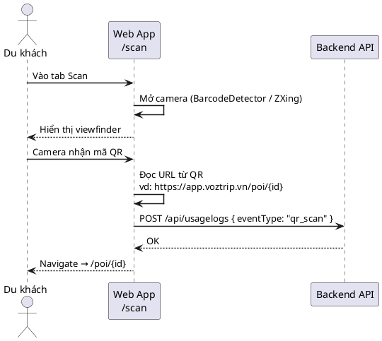
```plantuml
@startuml SEQ_QRScan
skinparam sequenceArrowThickness 1.5

actor "Du khách" as G
participant "Web App\n/scan" as WA
participant "Backend API" as BE

G -> WA: Vào tab Scan
WA -> WA: Mở camera (BarcodeDetector / ZXing)
WA --> G: Hiển thị viewfinder

G -> WA: Camera nhận mã QR
WA -> WA: Đọc URL từ QR\nvd: https://app.voztrip.vn/poi/{id}
WA -> BE: POST /api/usagelogs { eventType: "qr_scan" }
BE --> WA: OK
WA --> G: Navigate → /poi/{id}
@enduml
```

---

## 9. Sequence: Seller — Dashboard & Quản lý POI

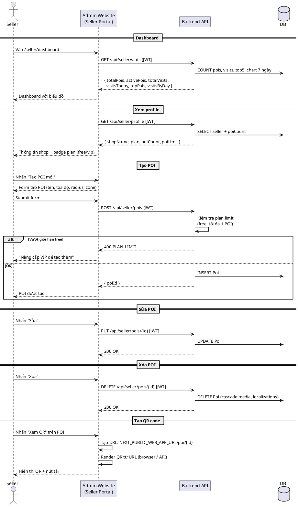
```plantuml
@startuml SEQ_Seller_POI
skinparam sequenceArrowThickness 1.5

actor "Seller" as S
participant "Admin Website\n(Seller Portal)" as AW
participant "Backend API" as BE
database "DB" as DB

== Dashboard ==
S -> AW: Vào /seller/dashboard
AW -> BE: GET /api/seller/stats [JWT]
BE -> DB: COUNT pois, visits, top5, chart 7 ngày
BE --> AW: { totalPois, activePois, totalVisits,\n  visitsToday, topPois, visitsByDay }
AW --> S: Dashboard với biểu đồ

== Xem profile ==
AW -> BE: GET /api/seller/profile [JWT]
BE -> DB: SELECT seller + poiCount
BE --> AW: { shopName, plan, poiCount, poiLimit }
AW --> S: Thông tin shop + badge plan (free/vip)

== Tạo POI ==
S -> AW: Nhấn "Tạo POI mới"
AW --> S: Form tạo POI (tên, tọa độ, radius, zone)
S -> AW: Submit form
AW -> BE: POST /api/seller/pois [JWT]
BE -> BE: Kiểm tra plan limit\n(free: tối đa 1 POI)
alt Vượt giới hạn free
  BE --> AW: 400 PLAN_LIMIT
  AW --> S: "Nâng cấp VIP để tạo thêm"
else OK
  BE -> DB: INSERT Poi
  BE --> AW: { poiId }
  AW --> S: POI được tạo
end

== Sửa POI ==
S -> AW: Nhấn "Sửa"
AW -> BE: PUT /api/seller/pois/{id} [JWT]
BE -> DB: UPDATE Poi
BE --> AW: 200 OK

== Xóa POI ==
S -> AW: Nhấn "Xóa"
AW -> BE: DELETE /api/seller/pois/{id} [JWT]
BE -> DB: DELETE Poi (cascade media, localizations)
BE --> AW: 200 OK

== Tạo QR code ==
S -> AW: Nhấn "Xem QR" trên POI
AW -> AW: Tạo URL: NEXT_PUBLIC_WEB_APP_URL/poi/{id}
AW -> AW: Render QR từ URL (browser / API)
AW --> S: Hiển thị QR + nút tải
@enduml
```

---

## 10. Sequence: Seller — Localization & Audio

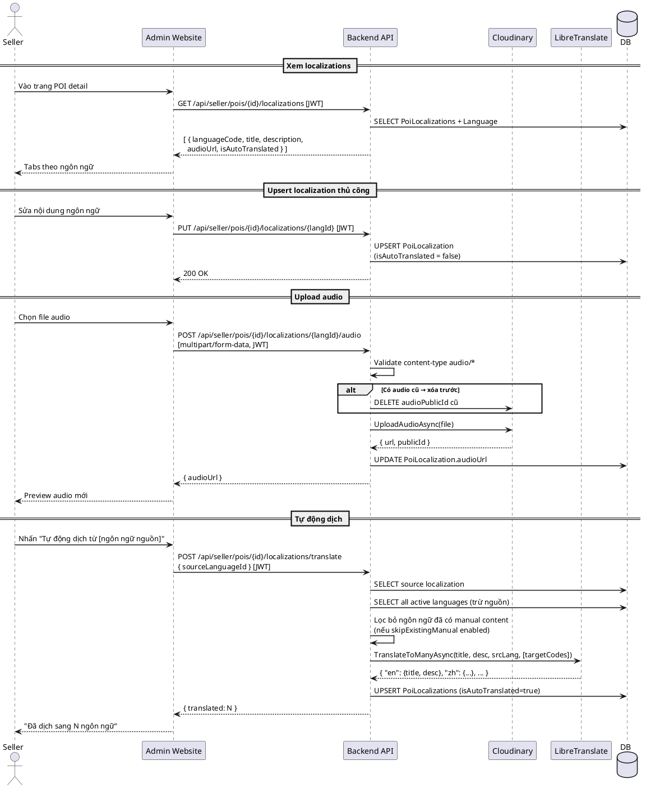
```plantuml
@startuml SEQ_Seller_Localization
skinparam sequenceArrowThickness 1.5

actor "Seller" as S
participant "Admin Website" as AW
participant "Backend API" as BE
participant "Cloudinary" as CL
participant "LibreTranslate" as LT
database "DB" as DB

== Xem localizations ==
S -> AW: Vào trang POI detail
AW -> BE: GET /api/seller/pois/{id}/localizations [JWT]
BE -> DB: SELECT PoiLocalizations + Language
BE --> AW: [ { languageCode, title, description,\n  audioUrl, isAutoTranslated } ]
AW --> S: Tabs theo ngôn ngữ

== Upsert localization thủ công ==
S -> AW: Sửa nội dung ngôn ngữ
AW -> BE: PUT /api/seller/pois/{id}/localizations/{langId} [JWT]
BE -> DB: UPSERT PoiLocalization\n(isAutoTranslated = false)
BE --> AW: 200 OK

== Upload audio ==
S -> AW: Chọn file audio
AW -> BE: POST /api/seller/pois/{id}/localizations/{langId}/audio\n[multipart/form-data, JWT]
BE -> BE: Validate content-type audio/*
alt Có audio cũ → xóa trước
  BE -> CL: DELETE audioPublicId cũ
end
BE -> CL: UploadAudioAsync(file)
CL --> BE: { url, publicId }
BE -> DB: UPDATE PoiLocalization.audioUrl
BE --> AW: { audioUrl }
AW --> S: Preview audio mới

== Tự động dịch ==
S -> AW: Nhấn "Tự động dịch từ [ngôn ngữ nguồn]"
AW -> BE: POST /api/seller/pois/{id}/localizations/translate\n{ sourceLanguageId } [JWT]
BE -> DB: SELECT source localization
BE -> DB: SELECT all active languages (trừ nguồn)
BE -> BE: Lọc bỏ ngôn ngữ đã có manual content\n(nếu skipExistingManual enabled)
BE -> LT: TranslateToManyAsync(title, desc, srcLang, [targetCodes])
LT --> BE: { "en": {title, desc}, "zh": {...}, ... }
BE -> DB: UPSERT PoiLocalizations (isAutoTranslated=true)
BE --> AW: { translated: N }
AW --> S: "Đã dịch sang N ngôn ngữ"
@enduml
```

---

## 11. Sequence: Seller — Media (Ảnh/Video)

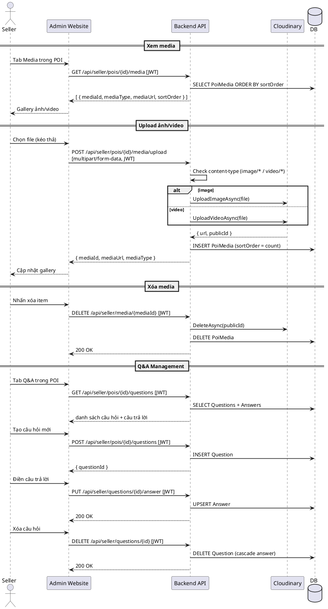
```plantuml
@startuml SEQ_Seller_Media
skinparam sequenceArrowThickness 1.5

actor "Seller" as S
participant "Admin Website" as AW
participant "Backend API" as BE
participant "Cloudinary" as CL
database "DB" as DB

== Xem media ==
S -> AW: Tab Media trong POI
AW -> BE: GET /api/seller/pois/{id}/media [JWT]
BE -> DB: SELECT PoiMedia ORDER BY sortOrder
BE --> AW: [ { mediaId, mediaType, mediaUrl, sortOrder } ]
AW --> S: Gallery ảnh/video

== Upload ảnh/video ==
S -> AW: Chọn file (kéo thả)
AW -> BE: POST /api/seller/pois/{id}/media/upload\n[multipart/form-data, JWT]
BE -> BE: Check content-type (image/* / video/*)
alt image
  BE -> CL: UploadImageAsync(file)
else video
  BE -> CL: UploadVideoAsync(file)
end
CL --> BE: { url, publicId }
BE -> DB: INSERT PoiMedia (sortOrder = count)
BE --> AW: { mediaId, mediaUrl, mediaType }
AW --> S: Cập nhật gallery

== Xóa media ==
S -> AW: Nhấn xóa item
AW -> BE: DELETE /api/seller/media/{mediaId} [JWT]
BE -> CL: DeleteAsync(publicId)
BE -> DB: DELETE PoiMedia
BE --> AW: 200 OK

== Q&A Management ==
S -> AW: Tab Q&A trong POI
AW -> BE: GET /api/seller/pois/{id}/questions [JWT]
BE -> DB: SELECT Questions + Answers
BE --> AW: danh sách câu hỏi + câu trả lời

S -> AW: Tạo câu hỏi mới
AW -> BE: POST /api/seller/pois/{id}/questions [JWT]
BE -> DB: INSERT Question
BE --> AW: { questionId }

S -> AW: Điền câu trả lời
AW -> BE: PUT /api/seller/questions/{id}/answer [JWT]
BE -> DB: UPSERT Answer
BE --> AW: 200 OK

S -> AW: Xóa câu hỏi
AW -> BE: DELETE /api/seller/questions/{id} [JWT]
BE -> DB: DELETE Question (cascade answer)
BE --> AW: 200 OK
@enduml
```

---

## 12. Sequence: Seller — Nâng cấp VIP & Boost POI (SePay)

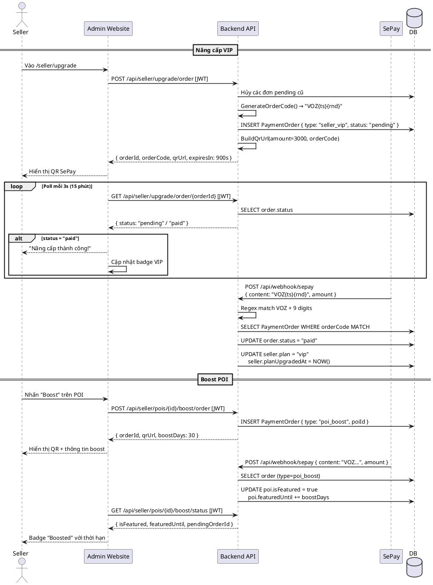
```plantuml
@startuml SEQ_Seller_Payment
skinparam sequenceArrowThickness 1.5

actor "Seller" as S
participant "Admin Website" as AW
participant "Backend API" as BE
participant "SePay" as SP
database "DB" as DB

== Nâng cấp VIP ==
S -> AW: Vào /seller/upgrade
AW -> BE: POST /api/seller/upgrade/order [JWT]
BE -> DB: Hủy các đơn pending cũ
BE -> BE: GenerateOrderCode() → "VOZ{ts}{rnd}"
BE -> DB: INSERT PaymentOrder { type: "seller_vip", status: "pending" }
BE -> BE: BuildQrUrl(amount=3000, orderCode)
BE --> AW: { orderId, orderCode, qrUrl, expiresIn: 900s }
AW --> S: Hiển thị QR SePay

loop Poll mỗi 3s (15 phút)
  AW -> BE: GET /api/seller/upgrade/order/{orderId} [JWT]
  BE -> DB: SELECT order.status
  BE --> AW: { status: "pending" / "paid" }
  alt status = "paid"
    AW --> S: "Nâng cấp thành công!"
    AW -> AW: Cập nhật badge VIP
  end
end

SP -> BE: POST /api/webhook/sepay\n{ content: "VOZ{ts}{rnd}", amount }
BE -> BE: Regex match VOZ + 9 digits
BE -> DB: SELECT PaymentOrder WHERE orderCode MATCH
BE -> DB: UPDATE order.status = "paid"
BE -> DB: UPDATE seller.plan = "vip"\n     seller.planUpgradedAt = NOW()

== Boost POI ==
S -> AW: Nhấn "Boost" trên POI
AW -> BE: POST /api/seller/pois/{id}/boost/order [JWT]
BE -> DB: INSERT PaymentOrder { type: "poi_boost", poiId }
BE --> AW: { orderId, qrUrl, boostDays: 30 }
AW --> S: Hiển thị QR + thông tin boost

SP -> BE: POST /api/webhook/sepay { content: "VOZ...", amount }
BE -> DB: SELECT order (type=poi_boost)
BE -> DB: UPDATE poi.isFeatured = true\n     poi.featuredUntil += boostDays

AW -> BE: GET /api/seller/pois/{id}/boost/status [JWT]
BE --> AW: { isFeatured, featuredUntil, pendingOrderId }
AW --> S: Badge "Boosted" với thời hạn
@enduml
```

---

## 13. Sequence: Admin — Dashboard & Quản lý Sellers/Users

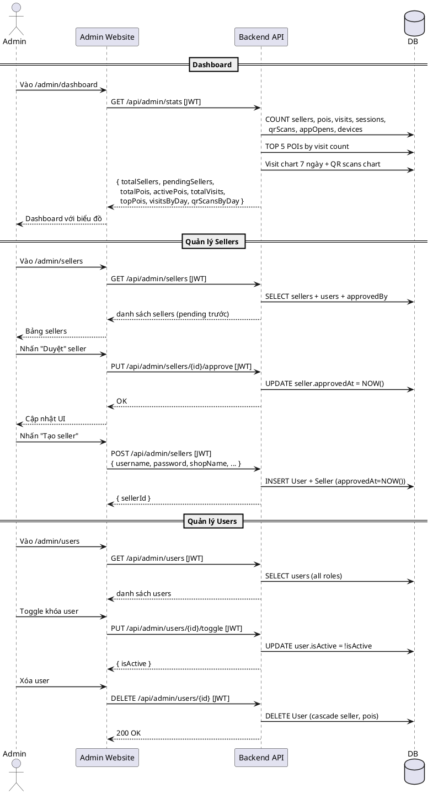
```plantuml
@startuml SEQ_Admin_Management
skinparam sequenceArrowThickness 1.5

actor "Admin" as A
participant "Admin Website" as AW
participant "Backend API" as BE
database "DB" as DB

== Dashboard ==
A -> AW: Vào /admin/dashboard
AW -> BE: GET /api/admin/stats [JWT]
BE -> DB: COUNT sellers, pois, visits, sessions,\n  qrScans, appOpens, devices
BE -> DB: TOP 5 POIs by visit count
BE -> DB: Visit chart 7 ngày + QR scans chart
BE --> AW: { totalSellers, pendingSellers,\n  totalPois, activePois, totalVisits,\n  topPois, visitsByDay, qrScansByDay }
AW --> A: Dashboard với biểu đồ

== Quản lý Sellers ==
A -> AW: Vào /admin/sellers
AW -> BE: GET /api/admin/sellers [JWT]
BE -> DB: SELECT sellers + users + approvedBy
BE --> AW: danh sách sellers (pending trước)
AW --> A: Bảng sellers

A -> AW: Nhấn "Duyệt" seller
AW -> BE: PUT /api/admin/sellers/{id}/approve [JWT]
BE -> DB: UPDATE seller.approvedAt = NOW()
BE --> AW: OK
AW --> A: Cập nhật UI

A -> AW: Nhấn "Tạo seller"
AW -> BE: POST /api/admin/sellers [JWT]\n{ username, password, shopName, ... }
BE -> DB: INSERT User + Seller (approvedAt=NOW())
BE --> AW: { sellerId }

== Quản lý Users ==
A -> AW: Vào /admin/users
AW -> BE: GET /api/admin/users [JWT]
BE -> DB: SELECT users (all roles)
BE --> AW: danh sách users

A -> AW: Toggle khóa user
AW -> BE: PUT /api/admin/users/{id}/toggle [JWT]
BE -> DB: UPDATE user.isActive = !isActive
BE --> AW: { isActive }

A -> AW: Xóa user
AW -> BE: DELETE /api/admin/users/{id} [JWT]
BE -> DB: DELETE User (cascade seller, pois)
BE --> AW: 200 OK
@enduml
```

---

## 14. Sequence: Admin — Kiểm duyệt POI & Media

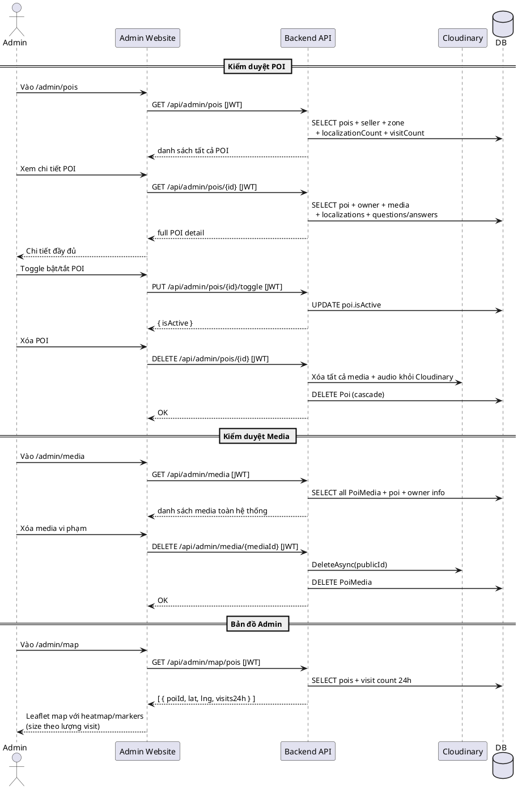
```plantuml
@startuml SEQ_Admin_Moderation
skinparam sequenceArrowThickness 1.5

actor "Admin" as A
participant "Admin Website" as AW
participant "Backend API" as BE
participant "Cloudinary" as CL
database "DB" as DB

== Kiểm duyệt POI ==
A -> AW: Vào /admin/pois
AW -> BE: GET /api/admin/pois [JWT]
BE -> DB: SELECT pois + seller + zone\n  + localizationCount + visitCount
BE --> AW: danh sách tất cả POI

A -> AW: Xem chi tiết POI
AW -> BE: GET /api/admin/pois/{id} [JWT]
BE -> DB: SELECT poi + owner + media\n  + localizations + questions/answers
BE --> AW: full POI detail
AW --> A: Chi tiết đầy đủ

A -> AW: Toggle bật/tắt POI
AW -> BE: PUT /api/admin/pois/{id}/toggle [JWT]
BE -> DB: UPDATE poi.isActive
BE --> AW: { isActive }

A -> AW: Xóa POI
AW -> BE: DELETE /api/admin/pois/{id} [JWT]
BE -> CL: Xóa tất cả media + audio khỏi Cloudinary
BE -> DB: DELETE Poi (cascade)
BE --> AW: OK

== Kiểm duyệt Media ==
A -> AW: Vào /admin/media
AW -> BE: GET /api/admin/media [JWT]
BE -> DB: SELECT all PoiMedia + poi + owner info
BE --> AW: danh sách media toàn hệ thống

A -> AW: Xóa media vi phạm
AW -> BE: DELETE /api/admin/media/{mediaId} [JWT]
BE -> CL: DeleteAsync(publicId)
BE -> DB: DELETE PoiMedia
BE --> AW: OK

== Bản đồ Admin ==
A -> AW: Vào /admin/map
AW -> BE: GET /api/admin/map/pois [JWT]
BE -> DB: SELECT pois + visit count 24h
BE --> AW: [ { poiId, lat, lng, visits24h } ]
AW --> A: Leaflet map với heatmap/markers\n(size theo lượng visit)
@enduml
```

---

## 15. Sequence: Admin — Thiết bị, Zones, Ngôn ngữ

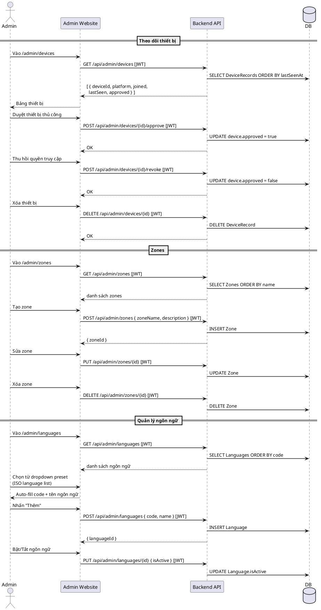
```plantuml
@startuml SEQ_Admin_Config
skinparam sequenceArrowThickness 1.5

actor "Admin" as A
participant "Admin Website" as AW
participant "Backend API" as BE
database "DB" as DB

== Theo dõi thiết bị ==
A -> AW: Vào /admin/devices
AW -> BE: GET /api/admin/devices [JWT]
BE -> DB: SELECT DeviceRecords ORDER BY lastSeenAt
BE --> AW: [ { deviceId, platform, joined,\n  lastSeen, approved } ]
AW --> A: Bảng thiết bị

A -> AW: Duyệt thiết bị thủ công
AW -> BE: POST /api/admin/devices/{id}/approve [JWT]
BE -> DB: UPDATE device.approved = true
BE --> AW: OK

A -> AW: Thu hồi quyền truy cập
AW -> BE: POST /api/admin/devices/{id}/revoke [JWT]
BE -> DB: UPDATE device.approved = false
BE --> AW: OK

A -> AW: Xóa thiết bị
AW -> BE: DELETE /api/admin/devices/{id} [JWT]
BE -> DB: DELETE DeviceRecord
BE --> AW: OK

== Zones ==
A -> AW: Vào /admin/zones
AW -> BE: GET /api/admin/zones [JWT]
BE -> DB: SELECT Zones ORDER BY name
BE --> AW: danh sách zones
A -> AW: Tạo zone
AW -> BE: POST /api/admin/zones { zoneName, description } [JWT]
BE -> DB: INSERT Zone
BE --> AW: { zoneId }
A -> AW: Sửa zone
AW -> BE: PUT /api/admin/zones/{id} [JWT]
BE -> DB: UPDATE Zone
A -> AW: Xóa zone
AW -> BE: DELETE /api/admin/zones/{id} [JWT]
BE -> DB: DELETE Zone

== Quản lý ngôn ngữ ==
A -> AW: Vào /admin/languages
AW -> BE: GET /api/admin/languages [JWT]
BE -> DB: SELECT Languages ORDER BY code
BE --> AW: danh sách ngôn ngữ
A -> AW: Chọn từ dropdown preset\n(ISO language list)
AW --> A: Auto-fill code + tên ngôn ngữ
A -> AW: Nhấn "Thêm"
AW -> BE: POST /api/admin/languages { code, name } [JWT]
BE -> DB: INSERT Language
BE --> AW: { languageId }
A -> AW: Bật/Tắt ngôn ngữ
AW -> BE: PUT /api/admin/languages/{id} { isActive } [JWT]
BE -> DB: UPDATE Language.isActive
@enduml
```

---

## 16. Sequence: Admin — Feature Flags & Feedback

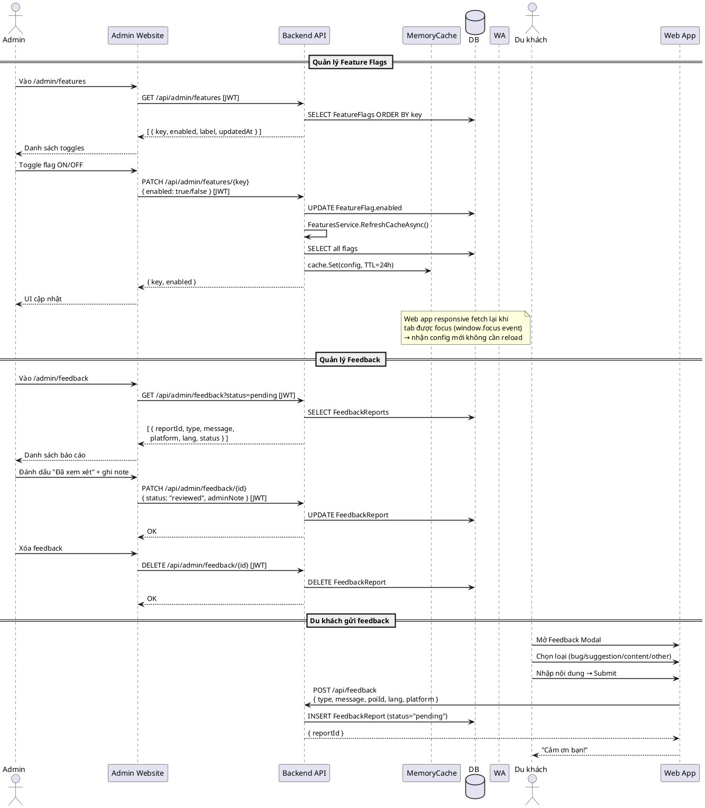
```plantuml
@startuml SEQ_Admin_Flags
skinparam sequenceArrowThickness 1.5

actor "Admin" as A
participant "Admin Website" as AW
participant "Backend API" as BE
participant "MemoryCache" as MC
database "DB" as DB

== Quản lý Feature Flags ==
A -> AW: Vào /admin/features
AW -> BE: GET /api/admin/features [JWT]
BE -> DB: SELECT FeatureFlags ORDER BY key
BE --> AW: [ { key, enabled, label, updatedAt } ]
AW --> A: Danh sách toggles

A -> AW: Toggle flag ON/OFF
AW -> BE: PATCH /api/admin/features/{key}\n{ enabled: true/false } [JWT]
BE -> DB: UPDATE FeatureFlag.enabled
BE -> BE: FeaturesService.RefreshCacheAsync()
BE -> DB: SELECT all flags
BE -> MC: cache.Set(config, TTL=24h)
BE --> AW: { key, enabled }
AW --> A: UI cập nhật

note over WA,MC: Web app responsive fetch lại khi\ntab được focus (window.focus event)\n→ nhận config mới không cần reload

== Quản lý Feedback ==
A -> AW: Vào /admin/feedback
AW -> BE: GET /api/admin/feedback?status=pending [JWT]
BE -> DB: SELECT FeedbackReports
BE --> AW: [ { reportId, type, message,\n  platform, lang, status } ]
AW --> A: Danh sách báo cáo

A -> AW: Đánh dấu "Đã xem xét" + ghi note
AW -> BE: PATCH /api/admin/feedback/{id}\n{ status: "reviewed", adminNote } [JWT]
BE -> DB: UPDATE FeedbackReport
BE --> AW: OK

A -> AW: Xóa feedback
AW -> BE: DELETE /api/admin/feedback/{id} [JWT]
BE -> DB: DELETE FeedbackReport
BE --> AW: OK

== Du khách gửi feedback ==
actor "Du khách" as G
participant "Web App" as WebApp
G -> WebApp: Mở Feedback Modal
G -> WebApp: Chọn loại (bug/suggestion/content/other)
G -> WebApp: Nhập nội dung → Submit
WebApp -> BE: POST /api/feedback\n{ type, message, poiId, lang, platform }
BE -> DB: INSERT FeedbackReport (status="pending")
BE --> WebApp: { reportId }
WebApp --> G: "Cảm ơn bạn!"
@enduml
```

---

## 17. Sequence: Feature Flags Runtime (Guard Middleware)

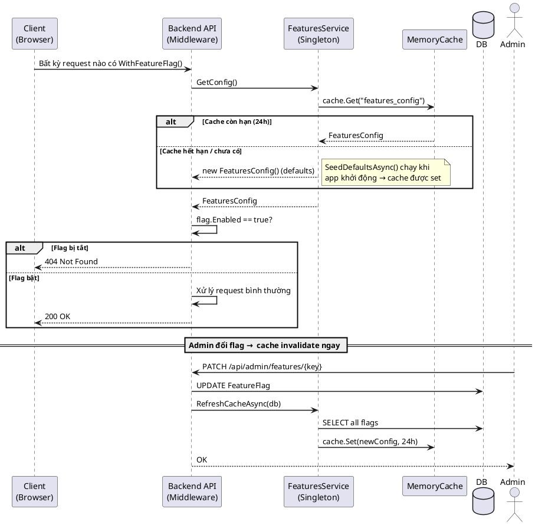
```plantuml
@startuml SEQ_FeatureFlag_Runtime
skinparam sequenceArrowThickness 1.5

participant "Client\n(Browser)" as C
participant "Backend API\n(Middleware)" as BE
participant "FeaturesService\n(Singleton)" as FS
participant "MemoryCache" as MC
database "DB" as DB

C -> BE: Bất kỳ request nào có WithFeatureFlag()

BE -> FS: GetConfig()
FS -> MC: cache.Get("features_config")
alt Cache còn hạn (24h)
  MC --> FS: FeaturesConfig
else Cache hết hạn / chưa có
  FS --> BE: new FeaturesConfig() (defaults)
  note right: SeedDefaultsAsync() chạy khi\napp khởi động → cache được set
end
FS --> BE: FeaturesConfig

BE -> BE: flag.Enabled == true?
alt Flag bị tắt
  BE --> C: 404 Not Found
else Flag bật
  BE -> BE: Xử lý request bình thường
  BE --> C: 200 OK
end

== Admin đổi flag →  cache invalidate ngay ==
actor "Admin" as A
A -> BE: PATCH /api/admin/features/{key}
BE -> DB: UPDATE FeatureFlag
BE -> FS: RefreshCacheAsync(db)
FS -> DB: SELECT all flags
FS -> MC: cache.Set(newConfig, 24h)
BE --> A: OK
@enduml
```

---

## 18. Sequence: SePay Webhook (Tổng hợp)

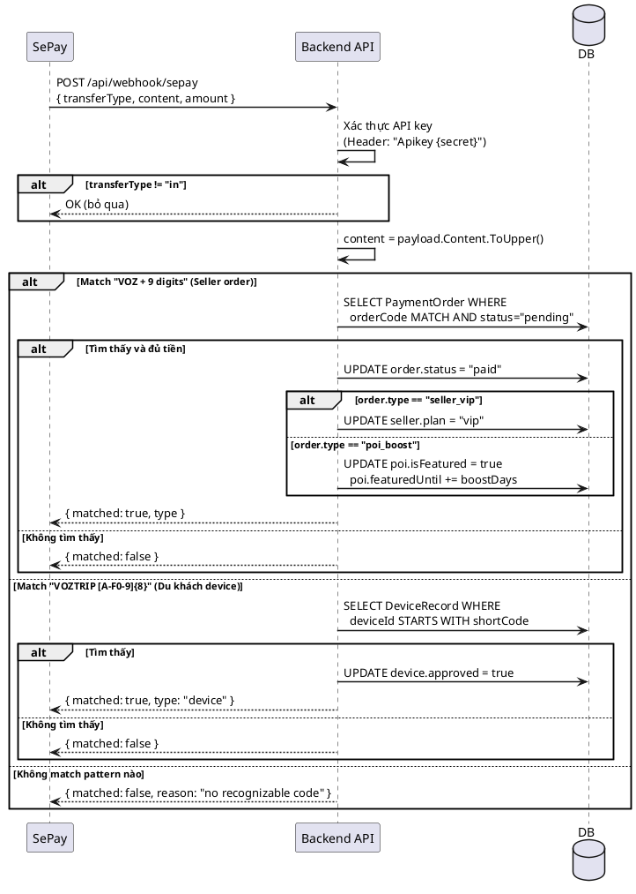
```plantuml
@startuml SEQ_SePay_Webhook
skinparam sequenceArrowThickness 1.5

participant "SePay" as SP
participant "Backend API" as BE
database "DB" as DB

SP -> BE: POST /api/webhook/sepay\n{ transferType, content, amount }
BE -> BE: Xác thực API key\n(Header: "Apikey {secret}")

alt transferType != "in"
  BE --> SP: OK (bỏ qua)
end

BE -> BE: content = payload.Content.ToUpper()

alt Match "VOZ + 9 digits" (Seller order)
  BE -> DB: SELECT PaymentOrder WHERE\n  orderCode MATCH AND status="pending"
  alt Tìm thấy và đủ tiền
    BE -> DB: UPDATE order.status = "paid"
    alt order.type == "seller_vip"
      BE -> DB: UPDATE seller.plan = "vip"
    else order.type == "poi_boost"
      BE -> DB: UPDATE poi.isFeatured = true\n  poi.featuredUntil += boostDays
    end
    BE --> SP: { matched: true, type }
  else Không tìm thấy
    BE --> SP: { matched: false }
  end

else Match "VOZTRIP [A-F0-9]{8}" (Du khách device)
  BE -> DB: SELECT DeviceRecord WHERE\n  deviceId STARTS WITH shortCode
  alt Tìm thấy
    BE -> DB: UPDATE device.approved = true
    BE --> SP: { matched: true, type: "device" }
  else Không tìm thấy
    BE --> SP: { matched: false }
  end

else Không match pattern nào
  BE --> SP: { matched: false, reason: "no recognizable code" }
end
@enduml
```

---

---

## 19. Sequence: Du khách — Xem Q&A tại POI

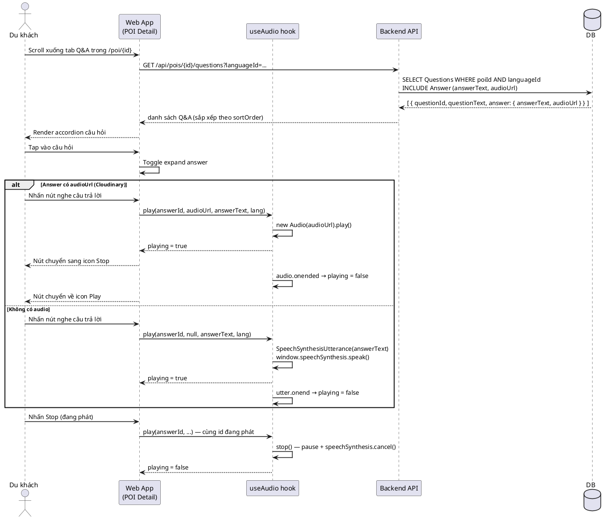
```plantuml
@startuml SEQ_Tourist_QnA
skinparam sequenceArrowThickness 1.5

actor "Du khách" as G
participant "Web App\n(POI Detail)" as WA
participant "useAudio hook" as AU
participant "Backend API" as BE
database "DB" as DB

G -> WA: Scroll xuống tab Q&A trong /poi/{id}
WA -> BE: GET /api/pois/{id}/questions?languageId=...
BE -> DB: SELECT Questions WHERE poiId AND languageId\nINCLUDE Answer (answerText, audioUrl)
DB --> BE: [ { questionId, questionText, answer: { answerText, audioUrl } } ]
BE --> WA: danh sách Q&A (sắp xếp theo sortOrder)
WA --> G: Render accordion câu hỏi

G -> WA: Tap vào câu hỏi
WA -> WA: Toggle expand answer

alt Answer có audioUrl (Cloudinary)
  G -> WA: Nhấn nút nghe câu trả lời
  WA -> AU: play(answerId, audioUrl, answerText, lang)
  AU -> AU: new Audio(audioUrl).play()
  AU --> WA: playing = true
  WA --> G: Nút chuyển sang icon Stop
  AU -> AU: audio.onended → playing = false
  WA --> G: Nút chuyển về icon Play
else Không có audio
  G -> WA: Nhấn nút nghe câu trả lời
  WA -> AU: play(answerId, null, answerText, lang)
  AU -> AU: SpeechSynthesisUtterance(answerText)\nwindow.speechSynthesis.speak()
  AU --> WA: playing = true
  AU -> AU: utter.onend → playing = false
end

G -> WA: Nhấn Stop (đang phát)
WA -> AU: play(answerId, ...) — cùng id đang phát
AU -> AU: stop() — pause + speechSynthesis.cancel()
AU --> WA: playing = false
@enduml
```

---

## 20. Sequence: Du khách — Phát Audio (useAudio standalone)

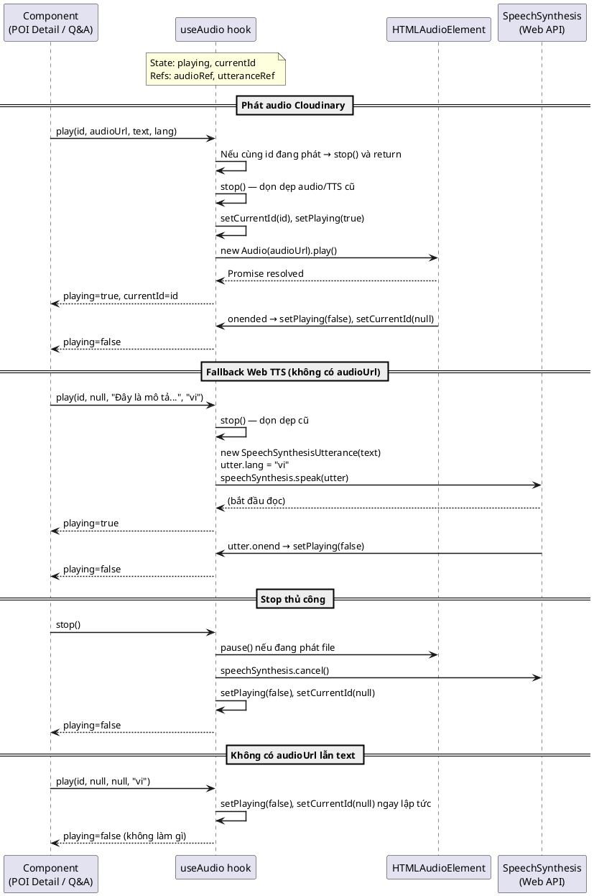
```plantuml
@startuml SEQ_Audio
skinparam sequenceArrowThickness 1.5

participant "Component\n(POI Detail / Q&A)" as C
participant "useAudio hook" as AU
participant "HTMLAudioElement" as HA
participant "SpeechSynthesis\n(Web API)" as SS

note over AU: State: playing, currentId\nRefs: audioRef, utteranceRef

== Phát audio Cloudinary ==
C -> AU: play(id, audioUrl, text, lang)
AU -> AU: Nếu cùng id đang phát → stop() và return
AU -> AU: stop() — dọn dẹp audio/TTS cũ
AU -> AU: setCurrentId(id), setPlaying(true)
AU -> HA: new Audio(audioUrl).play()
HA --> AU: Promise resolved
AU --> C: playing=true, currentId=id
HA -> AU: onended → setPlaying(false), setCurrentId(null)
AU --> C: playing=false

== Fallback Web TTS (không có audioUrl) ==
C -> AU: play(id, null, "Đây là mô tả...", "vi")
AU -> AU: stop() — dọn dẹp cũ
AU -> SS: new SpeechSynthesisUtterance(text)\nutter.lang = "vi"\nspeechSynthesis.speak(utter)
SS --> AU: (bắt đầu đọc)
AU --> C: playing=true
SS -> AU: utter.onend → setPlaying(false)
AU --> C: playing=false

== Stop thủ công ==
C -> AU: stop()
AU -> HA: pause() nếu đang phát file
AU -> SS: speechSynthesis.cancel()
AU -> AU: setPlaying(false), setCurrentId(null)
AU --> C: playing=false

== Không có audioUrl lẫn text ==
C -> AU: play(id, null, null, "vi")
AU -> AU: setPlaying(false), setCurrentId(null) ngay lập tức
AU --> C: playing=false (không làm gì)
@enduml
```

---

## 21. Sequence: Du khách — Gửi Feedback

```plantuml
@startuml SEQ_Feedback
skinparam sequenceArrowThickness 1.5

actor "Du khách" as G
participant "FeedbackModal" as FM
participant "api.ts\nsubmitFeedback()" as API
participant "Backend API" as BE
database "DB" as DB

G -> FM: Nhấn nút Feedback (AppShell)
FM -> FM: open=true → render modal

note over FM: Feature flag pages.feedback.enabled\nkiểm tra trước khi hiển thị nút

G -> FM: Chọn loại: bug | suggestion | content | other
G -> FM: Nhập message (max 1000 ký tự)
FM --> G: Hiển thị counter ký tự (x/1000)

G -> FM: Nhấn "Gửi phản hồi"
FM -> FM: Validate: message.trim() && length ≤ 1000
FM -> FM: setSubmitting(true)

FM -> API: submitFeedback({ sessionId, deviceId,\n  type, message, poiId?, platform:"web", lang })
API -> BE: POST /api/feedback\n{ sessionId, deviceId, type, message, poiId, platform, lang }

BE -> BE: Validate type ∈ ["bug","suggestion","content","other"]
BE -> BE: Validate message 1–1000 ký tự
alt Validation fail
  BE --> API: 400 Bad Request
  API --> FM: throw error
  FM -> FM: setSubmitting(false)\n(fail silently — không hiện lỗi)
else OK
  BE -> DB: INSERT FeedbackReport { status:"pending" }
  DB --> BE: saved
  BE --> API: 200 { reportId }
  API --> FM: resolved
  FM -> FM: setDone(true), setSubmitting(false)
  FM --> G: Hiển thị icon ✓ + "Cảm ơn phản hồi"
  FM -> FM: setTimeout 2s → setDone(false)\n  setMessage(""), onClose()
  FM --> G: Modal đóng
end
@enduml
```

---

## 22. Sequence: Du khách — Usage Log (Ghi sự kiện)

```plantuml
@startuml SEQ_UsageLog
skinparam sequenceArrowThickness 1.5

actor "Du khách" as G
participant "Web App" as WA
participant "useSession hook" as SH
participant "Backend API" as BE
database "DB" as DB

note over WA: Feature flag guest.usageLog.enabled\nphải bật mới ghi log

== Sự kiện: Mở app lần đầu ==
G -> WA: Truy cập web app (/, /home)
WA -> SH: useSession() khởi tạo
SH -> SH: sessionId = localStorage("voz_session")\nnếu chưa có → uuid() → lưu lại
SH -> BE: POST /api/sessions { sessionId, languageId }
BE -> DB: UPSERT GuestSession\n(INSERT nếu mới, skip nếu đã tồn tại)
SH -> BE: POST /api/usagelogs { sessionId, eventType:"app_open" }
BE -> BE: Validate eventType ∈ ["qr_scan","app_open","device_join"]
BE -> DB: INSERT UsageLog { sessionId, eventType:"app_open" }
BE --> SH: 200 { logId }

== Sự kiện: Quét QR ==
G -> WA: Scan QR code thành công
WA -> BE: POST /api/usagelogs { sessionId, eventType:"qr_scan" }
BE -> DB: INSERT UsageLog { sessionId, eventType:"qr_scan" }
BE --> WA: 200 { logId }

== Sự kiện: Thiết bị đăng ký (device_join) ==
G -> WA: Hoàn tất thanh toán device approval
WA -> BE: POST /api/usagelogs { sessionId, eventType:"device_join" }
BE -> DB: INSERT UsageLog { sessionId, eventType:"device_join" }
BE --> WA: 200 { logId }

== Feature flag tắt ==
WA -> BE: POST /api/usagelogs { ... }
BE -> BE: WithFeatureFlag(guest.usageLog) → flag=false
BE --> WA: 403 Feature disabled
WA -> WA: Bỏ qua lỗi (fire-and-forget)
@enduml
```

---

## 23. ERD — Entity Relationship Diagram

```plantuml
@startuml ERD_VozTrip
!define TABLE(name,desc) class name as "desc" << (T,#FFAAAA) >>
!define PK(x) <u>x</u>
!define FK(x) <i>x</i>

hide methods
hide stereotypes
skinparam classAttributeIconSize 0
skinparam classFontSize 12
skinparam class {
  BackgroundColor #FFFDF5
  BorderColor #C8A96E
  ArrowColor #8C7A5E
  HeaderBackgroundColor #F5EDD8
}

TABLE(User, "User") {
  PK(UserId) : string (UUID)
  --
  Username : string
  PasswordHash : string
  Role : string  -- "admin" | "seller"
  FullName : string?
  Email : string?
  IsActive : bool
  CreatedAt : datetime
}

TABLE(Seller, "Seller") {
  PK(SellerId) : string (= UserId)
  --
  FK(ApprovedBy) : string? → User
  ShopName : string
  ShopLogo : string?
  ContactPhone : string?
  Description : string?
  ApprovedAt : datetime?
  Plan : string  -- "free" | "vip"
  PlanUpgradedAt : datetime?
}

TABLE(Zone, "Zone") {
  PK(ZoneId) : string (UUID)
  --
  ZoneName : string
  Description : string?
}

TABLE(Poi, "Poi") {
  PK(PoiId) : string (UUID)
  --
  FK(SellerId) : string → Seller
  FK(ZoneId) : string? → Zone
  PoiName : string
  Latitude : double
  Longitude : double
  TriggerRadius : double  -- mét
  IsActive : bool
  IsFeatured : bool
  FeaturedUntil : datetime?
  CreatedAt : datetime
}

TABLE(PoiLocalization, "PoiLocalization") {
  PK(LocalizationId) : string (UUID)
  --
  FK(PoiId) : string → Poi
  FK(LanguageId) : string → Language
  Title : string?
  Description : string?
  AudioUrl : string?
  AudioPublicId : string?
  AudioDuration : int?  -- giây
  IsAutoTranslated : bool
}

TABLE(PoiMedia, "PoiMedia") {
  PK(MediaId) : string (UUID)
  --
  FK(PoiId) : string → Poi
  MediaType : string  -- "image" | "video"
  MediaUrl : string  -- Cloudinary URL
  PublicId : string  -- Cloudinary public_id
  SortOrder : int
}

TABLE(Language, "Language") {
  PK(LanguageId) : string (UUID)
  --
  LanguageCode : string  -- "vi" | "en" | "zh" | ...
  LanguageName : string?
  IsActive : bool
}

TABLE(Question, "Question") {
  PK(QuestionId) : string (UUID)
  --
  FK(PoiId) : string → Poi
  FK(LanguageId) : string → Language
  QuestionText : string
  SortOrder : int
  IsActive : bool
}

TABLE(Answer, "Answer") {
  PK(AnswerId) : string (UUID)
  --
  FK(QuestionId) : string → Question
  FK(PoiId) : string → Poi
  FK(LanguageId) : string → Language
  AnswerText : string
  AudioUrl : string?
  AudioPublicId : string?
}

TABLE(GuestSession, "GuestSession") {
  PK(SessionId) : string (UUID, app-generated)
  --
  FK(LanguageId) : string? → Language
  StartedAt : datetime
}

TABLE(VisitLog, "VisitLog") {
  PK(LogId) : string (UUID)
  --
  FK(SessionId) : string? → GuestSession
  FK(PoiId) : string? → Poi
  TriggeredAt : datetime
}

TABLE(UsageLog, "UsageLog") {
  PK(LogId) : string (UUID)
  --
  FK(SessionId) : string?
  EventType : string  -- "qr_scan" | "app_open"
  CreatedAt : datetime
}

TABLE(DeviceRecord, "DeviceRecord") {
  PK(DeviceId) : string (UUID, app-generated)
  --
  Platform : string  -- "ios" | "android"
  OsVersion : string
  JoinedAt : datetime
  LastSeenAt : datetime?
  Approved : bool
  ApprovedAt : datetime?
}

TABLE(PaymentOrder, "PaymentOrder") {
  PK(OrderId) : string (UUID)
  --
  FK(SellerId) : string → Seller
  FK(PoiId) : string? → Poi
  Type : string  -- "seller_vip" | "poi_boost"
  Amount : long
  OrderCode : string  -- unique ref in transfer desc
  Status : string  -- "pending" | "paid" | "expired"
  CreatedAt : datetime
  PaidAt : datetime?
}

TABLE(FeedbackReport, "FeedbackReport") {
  PK(ReportId) : string (UUID)
  --
  FK(SessionId) : string?
  FK(DeviceId) : string?
  FK(PoiId) : string?
  Type : string  -- "bug" | "suggestion" | "content" | "other"
  Message : string
  Platform : string  -- "web" | "ios" | "android"
  Lang : string
  Status : string  -- "pending" | "reviewed" | "resolved"
  AdminNote : string?
  ReviewedAt : datetime?
  CreatedAt : datetime
}

TABLE(FeatureFlag, "FeatureFlag") {
  PK(Key) : string  -- e.g. "guest.qrScan"
  --
  Enabled : bool
  Label : string  -- tên hiển thị (tiếng Việt)
  UpdatedAt : datetime
}

' === Relationships ===

User "1" -- "0..1" Seller : "1 User → 1 Seller profile"
User "1" -- "0..*" Seller : "approves >"

Seller "1" -- "0..*" Poi : "owns >"
Seller "1" -- "0..*" PaymentOrder : "pays >"

Zone "1" -- "0..*" Poi : "groups >"

Poi "1" -- "0..*" PoiLocalization : "has translations >"
Poi "1" -- "0..*" PoiMedia : "has media >"
Poi "1" -- "0..*" Question : "has Q&A >"
Poi "1" -- "0..*" VisitLog : "logged by >"
Poi "1" -- "0..*" PaymentOrder : "boosted via >"
Poi "1" -- "0..*" FeedbackReport : "reported on >"

Language "1" -- "0..*" PoiLocalization : "localizes >"
Language "1" -- "0..*" Question : "used in >"
Language "1" -- "0..*" Answer : "used in >"
Language "1" -- "0..*" GuestSession : "selected by >"

Question "1" -- "0..1" Answer : "answered by >"

GuestSession "1" -- "0..*" VisitLog : "generates >"

@enduml
```

---

*Tất cả diagram có thể render trực tiếp tại [plantuml.com/plantuml](https://www.plantuml.com/plantuml/uml) hoặc qua extension PlantUML trong VS Code.*
